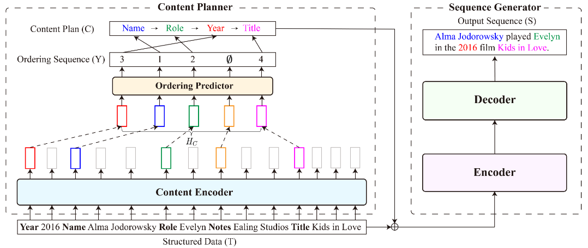

# 一、项目说明
## (1) 方法
### 框架

Content Planner:输入表格，输出表头次序。
<br>Generator:输入表格和表头次序，输出文本。
### 数据


## (2) 文件结构
    .
    ├── 中文数据
    │   ├── raw:原始数据（根据初赛数据构造）
    │   ├── processed:预处理数据（table+sentence+plan）
    │   └── process.py:数据预处理脚本
    ├── 中文预训练模型
    │   ├── bert-base-chinese
    │   └── t5-pegasus
    ├── content_planner
    │   ├── ckpt-chinese:模型文件
    │   ├── contentplanner.py:模型结构定义(content encoder)
    │   ├── dynamic_crf_layer.py:模型结构定义(ordering predictor)
    │   ├── dataclass.py:数据格式定义
    │   ├── train.py:训练代码
    │   └── inference.py:推理代码
    ├── generator
    │   ├── ckpt:模型文件
    │   ├── dataclass.py:数据格式定义
    │   ├── pretrain.py:预训练代码
    │   ├── finetune.py:强化学习微调代码
    │   └── perform_inference.py:推理代码
    ├── README.md
    └── test.py:推理测试脚本
## (3) 参考
### 论文：
```bibtex
@inproceedings{su-etal-2021-plan-generate,
    title = "Plan-then-Generate: Controlled Data-to-Text Generation via Planning",
    author = "Su, Yixuan  and
      Vandyke, David  and
      Wang, Sihui  and
      Fang, Yimai  and
      Collier, Nigel",
    booktitle = "Findings of the Association for Computational Linguistics: EMNLP 2021",
    month = nov,
    year = "2021",
    address = "Punta Cana, Dominican Republic",
    publisher = "Association for Computational Linguistics",
    url = "https://aclanthology.org/2021.findings-emnlp.76",
    pages = "895--909",
    abstract = "Recent developments in neural networks have led to the advance in data-to-text generation. However, the lack of ability of neural models to control the structure of generated output can be limiting in certain real-world applications. In this study, we propose a novel Plan-then-Generate (PlanGen) framework to improve the controllability of neural data-to-text models. Extensive experiments and analyses are conducted on two benchmark datasets, ToTTo and WebNLG. The results show that our model is able to control both the intra-sentence and inter-sentence structure of the generated output. Furthermore, empirical comparisons against previous state-of-the-art methods show that our model improves the generation quality as well as the output diversity as judged by human and automatic evaluations.",
}
```
### 数据来源：
https://www.datafountain.cn/competitions/633/datasets
# 二、数据集
## (1) 数据文件
    .
    ├── raw:根据初赛数据构造的原始数据
    │   ├── train.json:训练集，包括8000条
    │   ├── dev.json:验证集，包括100条
    │   └── test.json:测试集，包括49条
    ├── processed:根据原始数据处理的训练数据
    │   ├── train
    │   │   ├──table.txt:表格
    │   │   ├──sentence.txt:句
    │   │   └──plan.txt:次序
    │   ├── test
    │   │   ├──table.txt:表格
    │   │   ├──sentence.txt:句
    │   │   └──plan.txt:次序
    │   ├── dev
    │   │   ├──table.txt:表格
    │   │   ├──sentence.txt:句
    │   │   └──plan.txt:次序
    │   └── special_token.txt:表token
    └── process.py:数据处理脚本

## (2) 数据格式
raw:
``` json
{
        "id": 1,
        "text": "经过数年的研制,越南陆军开始装备国产T-55M3型主战坦克｡该型坦克最早于2000年代末期首次亮相｡早期,越军声称T-M3主战坦克装备的是125毫米滑膛炮,但从近期越南公开的照片看,只装备L7型105毫米坦克炮｡该型坦克在炮塔四周加装了一圈复合装甲板,防护性能应该比原来的T-55/54坦克要好｡",
        "record": {
            "国家": [
                "越南"
            ],
            "武器名称": [
                "T-55M3"
            ],
            "武器类型": [
                "主战坦克"
            ],
            "军事行动": [
                "装备"
            ]
        }
}
```
table:
```html
__国家__ : 越南 __EOS__ __武器名称__ : T-55M3 __EOS__ __武器类型__ : 主战坦克 __EOS__ __军事行动__ : 装备 __EOS__
```
sentence:
```html
经过数年的研制,越南陆军开始装备国产T-55M3型主战坦克｡该型坦克最早于2000年代末期首次亮相｡早期,越军声称T-M3主战坦克装备的是125毫米滑膛炮,但从近期越南公开的照片看,只装备L7型105毫米坦克炮｡该型坦克在炮塔四周加装了一圈复合装甲板,防护性能应该比原来的T-55/54坦克要好｡
```
plan:
```html
__国家__ __军事行动__ __武器名称__ __武器类型__
```

# 三、Content Planner
## (1) 训练
``` bash
python content_planner/train.py --model_name ../中文预训练模型/bert-base-chinese --crf_low_rank 64 --crf_beam_size 9 --train_src_path ../中文数据/processed/train/table.txt --train_tgt_path ../中文数据/processed/train/plan.txt --dev_src_path ../中文数据/processed/dev/table.txt --dev_tgt_path ../中文数据/processed/dev/plan.txt --max_src_len 640 --max_tgt_len 50 --special_token_path ../中文数据/processed/special_token.txt --min_slot_key_cnt 3 --number_of_gpu 1 --batch_size_per_gpu 8 --gradient_accumulation_steps 16 --effective_batch_size 128 --total_steps 40000 --print_every 100 --save_every 500 --learning_rate 2e-5 --mle_loss_weight 0.5 --save_path_prefix ./ckpt-chinese/
```
控制台参数：
* `--model_name`: huggingface预训练模型。
* `--crf_low_rank`: The low rank configuration of the CRF layer. For more details, please refer to the Section 3.1 of our another paper (https://aclanthology.org/2021.eacl-main.18.pdf).
* `--crf_beam_size`: The beam width of the CRF layer. For more details, please refer to the Section 3.1 of our another paper (https://aclanthology.org/2021.eacl-main.18.pdf).
* `--train_src_path`: 训练集数据中的table文件路径。
* `--train_tgt_path`: 训练集数据中的plan文件路径。
* `--dev_src_path`: 验证集数据中的table文件路径。
* `--dev_tgt_path`: 验证集数据中的plan文件路径。
* `--max_src_len`: table序列的最大长度。
* `--max_tgt_len`: plan序列的最大长度。
* `--special_token_path`: special token文件路径。
* `--min_slot_key_cnt`: special token的最少出现次数。
* `--number_of_gpu`: 可用gpu数量。
* `--batch_size_per_gpu`: 每个gpu的batch size。
* `--gradient_accumulation_steps`: 两次梯度更新之间的正向计算次数。
* `--effective_batch_size`: The overall batch size. It equals to batch_size_per_gpu x gradient_accumulation_steps x number_of_gpu.
* `--total_steps`: 梯度更新的总步数。
* `--print_every`: 每隔多少步输出一次结果。
* `--save_every`: 每隔多少步保存一次模型文件。
* `--learning_rate`: 学习率。
* `--mle_loss_weight`: 训练目标中MLE损失的权重。
* `--save_path_prefix`: 模型文件保存路径。

## (2) 推理
``` bash
python content_planner/inference.py
```

# 四、Sequence Generator
## (1) 预训练generator
```bash
python generator/pretrain.py --train_table_text_path ../中文数据/processed/train/table.txt --train_content_text_path ../中文数据/processed/train/plan.txt --train_reference_sentence_path ../中文数据/processed/train/sentence.txt --dev_table_text_path ../中文数据/processed/dev/table.txt --dev_content_text_path ../中文数据/processed/dev/plan.txt --dev_reference_sentence_path ../中文数据/processed/dev/sentence.txt --special_token_path ../中文数据/processed/special_token.txt --ckpt_path ./ckpt-chinese/pretrain/
```
## (2) 推理
```bash
python test.py
```

# 五、演示
表格：

| 时间 | 地点 | 行动 | 时长 | 单位 |
| ------ | ------ |----| ------ | ------ |
| 5月14日 | 塞内加尔达喀尔港 | 友好访问 | 3天 | 中国海军第十六批护航编队 |
生成句子:
```
当地时间5月14日，中国海军第十六批护航编队抵达塞内加尔达喀尔港，开始对塞内加尔进行为期3天的友好访问。新华社发
```
GT句子：
```
5月14日，塞内加尔达喀尔港，当地妇女在到访的中国军舰上合影。当日，中国海军第十六批护航编队抵达塞内加尔达喀尔港，开始对塞内加尔进行为期3天的友好访问。新华社记者邰剑秋摄
```
已训练好的模型文件：
<br>content_planner：https://huggingface.co/ToughStone/content_planner
<br>content_planner：https://huggingface.co/ToughStone/generator